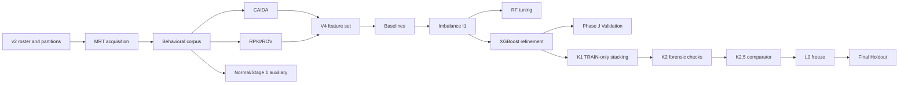

# Experiment Dependency Graph v1

```mermaid
flowchart LR
    R[v2 roster and partitions] --> M[MRT acquisition]
    M --> B[Behavioral corpus]
    B --> C[CAIDA]
    B --> P[RPKI/ROV]
    C --> V4[V4 feature set]
    P --> V4
    B --> N[Normal/Stage 1 auxiliary]
    V4 --> BL[Baselines]
    BL --> I[Imbalance I1]
    I --> RF[RF tuning]
    I --> XGB[XGBoost refinement]
    XGB --> J[Phase J Validation]
    XGB --> K1[K1 TRAIN-only stacking]
    K1 --> K2[K2 forensic checks]
    K2 --> K25[K2.5 comparator]
    K25 --> L0[L0 freeze]
    L0 --> H[Final Holdout]
```
