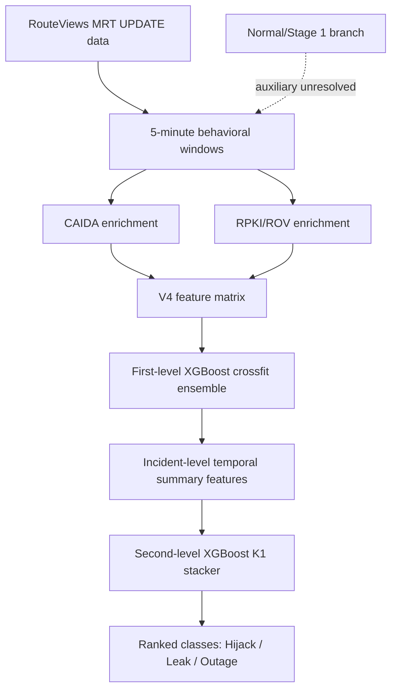

# Final Architecture Flow v1

```mermaid
flowchart TD
    A[RouteViews MRT UPDATE data] --> B[5-minute behavioral windows]
    B --> C[CAIDA enrichment]
    B --> D[RPKI/ROV enrichment]
    C --> E[V4 feature matrix]
    D --> E
    E --> F[First-level XGBoost crossfit ensemble]
    F --> G[Incident-level temporal summary features]
    G --> H[Second-level XGBoost K1 stacker]
    H --> I[Ranked classes: Hijack / Leak / Outage]
    N[Normal/Stage 1 branch] -. auxiliary unresolved .-> B
```
